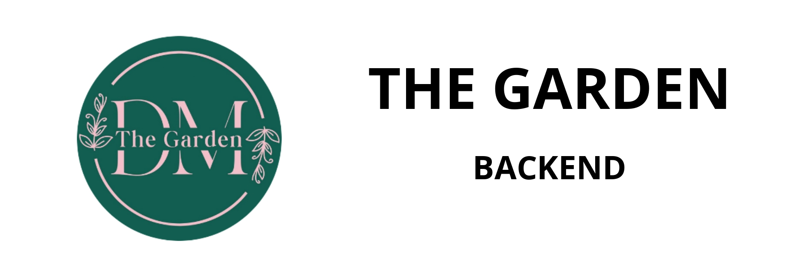

<h1 style="text-align:center;">THE GARDEN - BACKEND</h1>



Esta aplicacion funciona para gestionar los servicios, controladores, schemas y modelos de la base de datos, guardando los datos en MySQL e imagenes de Firebase Storage, con autenticacion con google.

## Recursos usados

- [python](https://www.python.org/) version 3.10.11

## Complementos de app

- [CLIENTE - APP MOVIL](https://github.com/JHuancaDev/flutter_restaurante.git)
- [Administrador - aplicacion web](https://github.com/JHuancaDev/f-restaurante.git)

## Instalacion local

Clonar repositorio

```bash
git clone https://github.com/JHuancaDev/back-restaurante.git
```

Instalar dependencias

```bash
pip install -r requirements.txt
```

Ejecutar 

```bash
python main.py
```

Ingresar en navegador

```bash
http://localhost:8000/docs
```
## Desarrollador por:
- [JHuancaDev](https://github.com/JHuancaDev)